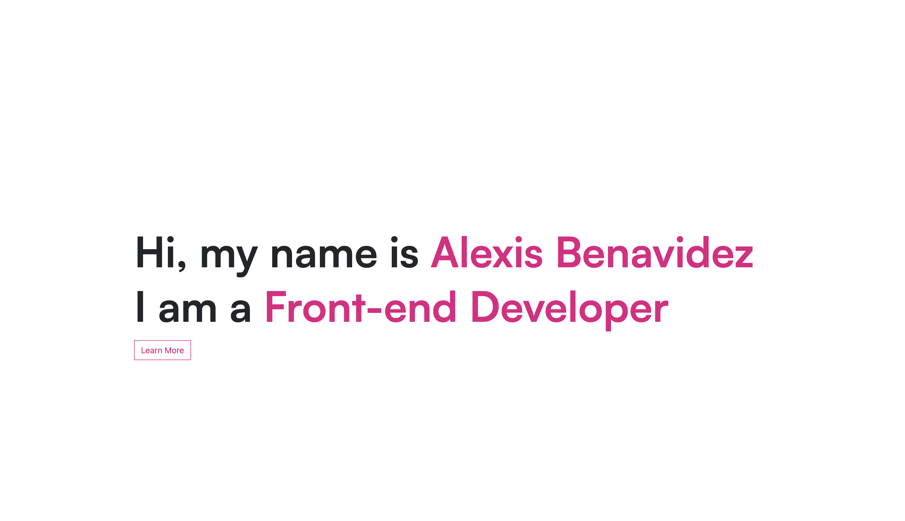
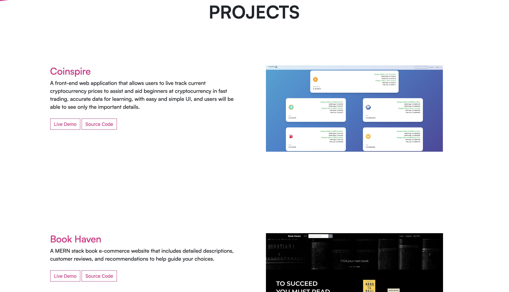
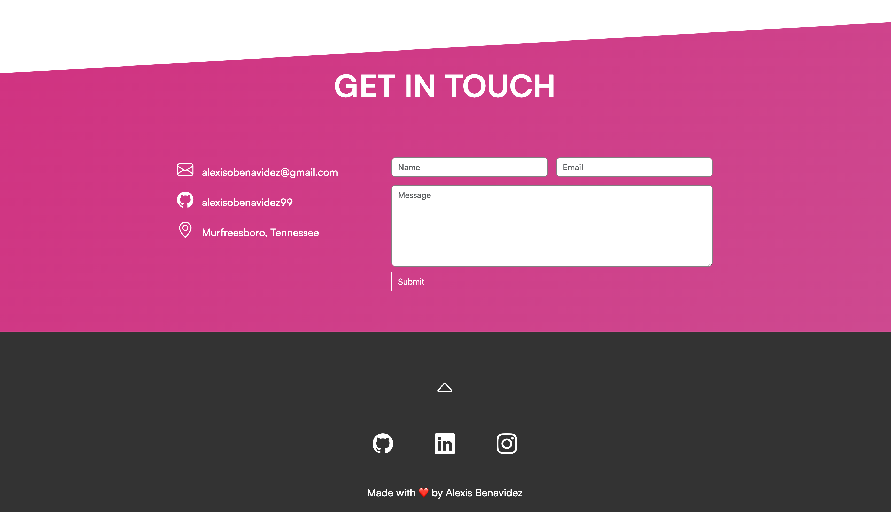

# Alexis Benavidez Personal Portfolio 💫

This is a website to showcase my past projects with more to be added soon and several ways to connect with me!

## Technologies Used

· Parcel  
· HTML5  
· CSS3  
· NodeJS  
· Git  
· GitHub  
· Bootstrap  
· JQuery  
· ScrollReveal.js  
· Tilt.js

## Visuals

